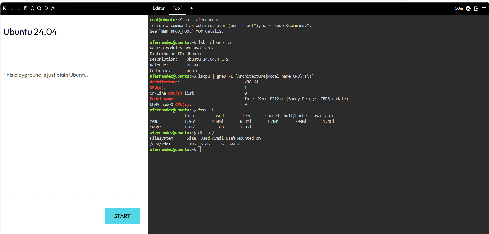

## Checkpoint 7 – Linux Investigation

### System Information

| Category | Information |
|---|---|
| Operating System | Ubuntu 24.04.4 LTS |
| Codename | Noble |
| Architecture | x86_64 |
| CPU | Intel Xeon E312xx |
| CPU Count | 1 |
| Memory | 1.9 GiB |
| Swap | 1.0 GiB |
| Disk | 19 GB |
| Available Disk | 13 GB |

### Cloud Migration

If this Linux server were migrated to the cloud, it could be hosted using:

- **AWS:** Amazon EC2
- **Microsoft Azure:** Azure Virtual Machines
- **Google Cloud:** Compute Engine

These services provide virtual machines capable of running Linux operating systems.

### Screenshot Evidence

