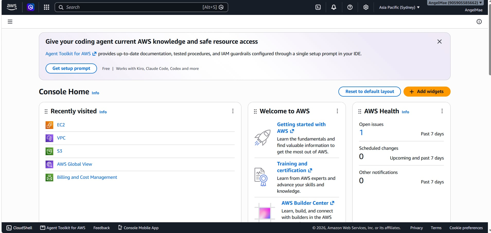

# AWS Research

> **Platform:** Amazon Web Services (AWS)  
> **Provider:** Amazon  
> **Research focus:** Infrastructure, management, core services, advantages, and enterprise use cases

## 1. Brief Overview

Amazon Web Services (AWS) is Amazon's cloud computing platform. It provides a wide range of services for computing, storage, databases, networking, security, analytics, and application development. Organizations can use these services to build and run applications without maintaining all of the physical infrastructure themselves.

## 2. Global Infrastructure

AWS organizes its infrastructure into **Geographic Regions** and **Availability Zones (AZs)**. A Region is a physical geographic location where AWS clusters its infrastructure. Availability Zones are separate infrastructure locations within a Region and are designed to provide isolation from failures.

According to AWS, its cloud currently spans **39 launched Regions and 123 Availability Zones**. AWS also provides other infrastructure options, including Local Zones and Wavelength Zones, for workloads that need lower latency.

## 3. Cloud Management Console

The **AWS Management Console** is a web-based interface used to access and manage AWS services. Users can create and configure resources, monitor services, manage access, and work with account and billing information.

The console organizes services into categories such as Compute, Storage, Databases, Networking, Security, and Management.

## 4. Four Core Services

| AWS Service | Main Function |
|---|---|
| **Amazon EC2** | Provides virtual computing capacity for running applications and workloads. |
| **Amazon S3** | Provides object storage for files, backups, and other data. |
| **Amazon RDS** | Provides a managed relational database service. |
| **Amazon VPC** | Provides an isolated virtual network for AWS resources. |

## 5. Three Advantages

### 1. Wide Range of Services

AWS provides services for many areas of cloud computing, including computing, storage, databases, networking, security, analytics, and artificial intelligence.

### 2. Global Infrastructure

AWS has Regions and Availability Zones distributed across different geographic areas. This allows organizations to choose locations based on factors such as latency, service availability, and regulatory requirements.

### 3. Scalability and Resilience

Organizations can adjust cloud resources according to their workloads. Applications can also be distributed across multiple Availability Zones to improve availability and fault tolerance.

## 6. Typical Enterprise Use Cases

AWS can be used by organizations for:

- Web and application hosting
- Virtual server deployment
- Data storage and backup
- Database hosting
- Data analytics
- Artificial intelligence and machine learning
- Disaster recovery
- Global application deployment

## 7. Screenshot Evidence

*Figure 1. AWS Management Console.*

## 8. References

1. Amazon Web Services. (n.d.). *AWS Global Infrastructure*.  
   https://aws.amazon.com/about-aws/global-infrastructure/

2. Amazon Web Services. (n.d.). *AWS Regions and Availability Zones*.  
   https://aws.amazon.com/about-aws/global-infrastructure/regions_az/

3. Amazon Web Services. (n.d.). *AWS Documentation*.  
   https://docs.aws.amazon.com/

4. Amazon Web Services. (n.d.). *AWS Management Console*.  
   https://aws.amazon.com/console/
