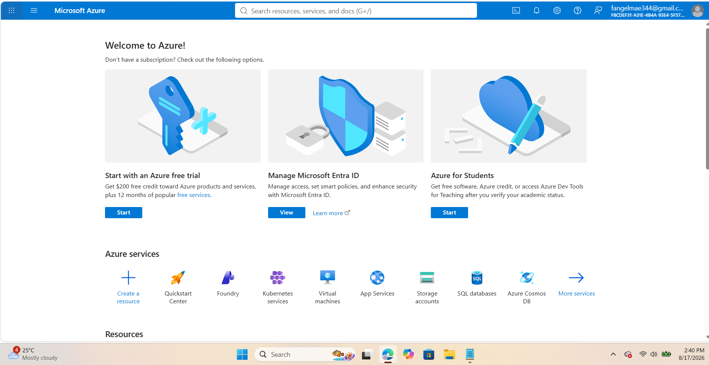

# Microsoft Azure Research

> **Platform:** Microsoft Azure  
> **Provider:** Microsoft  
> **Research focus:** Infrastructure, management, core services, advantages, and enterprise use cases

## 1. Brief Overview

Microsoft Azure is Microsoft's cloud computing platform. It provides cloud services for computing, storage, databases, networking, security, analytics, artificial intelligence, and application development.

Organizations can use Azure to build, deploy, manage, and monitor applications and IT infrastructure in the cloud.

## 2. Global Infrastructure

Azure provides cloud infrastructure through geographic **regions** and **geographies** around the world. An Azure geography contains one or more regions and is designed to support requirements such as data residency and compliance.

Microsoft's current global infrastructure information lists **80+ Azure regions and 500+ datacenters**. Azure also provides Availability Zones in supported regions to help improve application availability and resilience.

## 3. Cloud Management Console

The **Azure portal** is a web-based, unified console for creating and managing Azure resources. Users can create, configure, monitor, and manage services such as virtual machines, databases, storage, networking, and applications.

The portal also provides dashboards, search, resource management, monitoring, and cost-management features.

## 4. Four Core Services

| Azure Service | Main Function |
|---|---|
| **Azure Virtual Machines** | Provides virtual machines for running applications and workloads. |
| **Azure Blob Storage** | Provides scalable object storage for unstructured data. |
| **Azure SQL Database** | Provides a managed relational database service. |
| **Azure Virtual Network** | Provides private networking for Azure resources. |

## 5. Three Advantages

### 1. Microsoft Ecosystem Integration

Azure works closely with Microsoft technologies and enterprise products, making it useful for organizations already using Microsoft-based infrastructure.

### 2. Global Infrastructure

Azure provides regions and datacenters across many geographic locations. Organizations can select locations based on requirements such as latency, availability, and data residency.

### 3. Hybrid Cloud Support

Azure provides tools and services that help organizations connect on-premises infrastructure with cloud resources, supporting hybrid cloud environments.

## 6. Typical Enterprise Use Cases

Azure can be used by organizations for:

- Enterprise application hosting
- Windows Server workloads
- Database hosting
- Hybrid cloud infrastructure
- Web application development
- Data analytics
- Artificial intelligence and machine learning
- Virtual machine deployment

## 7. Screenshot Evidence

*Figure 1. Microsoft Azure Portal.*

## 8. References

1. Microsoft Azure. (n.d.). *Azure Global Infrastructure*.  
   https://azure.microsoft.com/en-us/explore/global-infrastructure/

2. Microsoft Learn. (n.d.). *What is the Azure portal?*  
   https://learn.microsoft.com/en-us/azure/azure-portal/azure-portal-overview

3. Microsoft Learn. (n.d.). *Manage Azure resources by using the Azure portal*.  
   https://learn.microsoft.com/en-us/azure/azure-resource-manager/management/manage-resources-portal

4. Microsoft Learn. (n.d.). *Azure Virtual Machines documentation*.  
   https://learn.microsoft.com/en-us/azure/virtual-machines/
