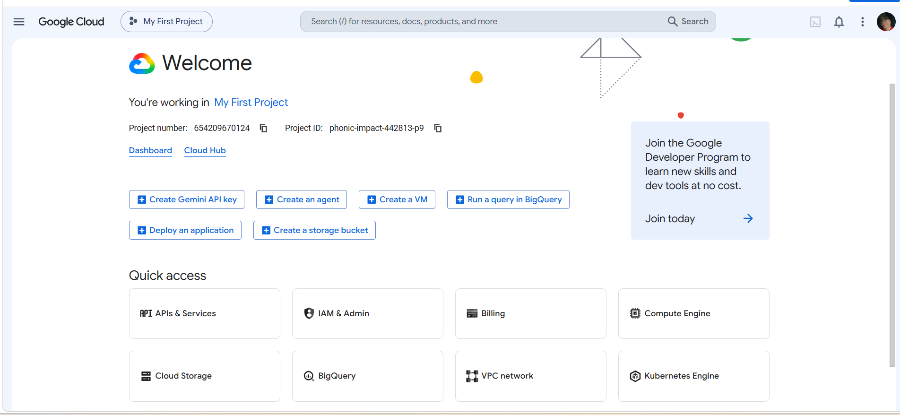

# Google Cloud Platform (GCP) Research

> **Platform:** Google Cloud Platform (GCP)  
> **Provider:** Google  
> **Research focus:** Infrastructure, management, core services, advantages, and enterprise use cases

## 1. Brief Overview

Google Cloud Platform (GCP), commonly called Google Cloud, is Google's cloud computing platform. It provides services for computing, storage, databases, networking, containers, data analytics, artificial intelligence, machine learning, and application development.

Organizations can use Google Cloud to deploy and manage applications and IT infrastructure using Google's global cloud environment.

## 2. Global Infrastructure

Google Cloud organizes its infrastructure into **regions** and **zones**. A region is a geographic area containing multiple zones. Zones provide separate deployment locations within a region and can be used to improve availability when workloads are distributed across locations.

Google Cloud currently provides **43 regions and 130 zones**, with infrastructure available across multiple continents. Google also operates a global network designed to provide connectivity and low-latency access for cloud workloads.

## 3. Cloud Management Console

The **Google Cloud Console** is a web-based interface used to manage Google Cloud projects, resources, and services. Users can create and configure resources, monitor infrastructure, manage projects, and access cloud services through the console.

The console can be used together with Google Cloud command-line tools and APIs for managing cloud resources.

## 4. Four Core Services

| Google Cloud Service | Main Function |
|---|---|
| **Compute Engine** | Provides virtual machines for running applications and workloads. |
| **Cloud Storage** | Provides scalable object storage for files and other data. |
| **Cloud SQL** | Provides a fully managed relational database service. |
| **Google Kubernetes Engine (GKE)** | Provides managed Kubernetes infrastructure for containerized applications. |

## 5. Three Advantages

### 1. AI and Machine Learning Capabilities

Google Cloud provides infrastructure and services for artificial intelligence and machine learning workloads.

### 2. Kubernetes and Container Support

Google Kubernetes Engine (GKE) provides managed Kubernetes infrastructure for organizations running containerized applications.

### 3. Global Infrastructure and Networking

Google Cloud provides regions and zones across multiple geographic locations and operates a global network for connecting cloud workloads and users.

## 6. Typical Enterprise Use Cases

Google Cloud can be used by organizations for:

- Artificial intelligence and machine learning
- Big-data analytics
- Containerized applications
- Web and application hosting
- Database hosting
- Data processing
- Software development
- Global application deployment

## 7. Screenshot Evidence

*Figure 1. Google Cloud Console.*

## 8. References

1. Google Cloud. (n.d.). *Cloud Locations*.  
   https://cloud.google.com/about/locations/

2. Google Cloud Documentation. (n.d.). *Geography and regions*.  
   https://docs.cloud.google.com/docs/geography-and-regions

3. Google Cloud Documentation. (n.d.). *Compute Engine overview*.  
   https://docs.cloud.google.com/compute/docs/overview

4. Google Cloud Documentation. (n.d.). *Cloud SQL overview*.  
   https://docs.cloud.google.com/sql/docs/introduction
