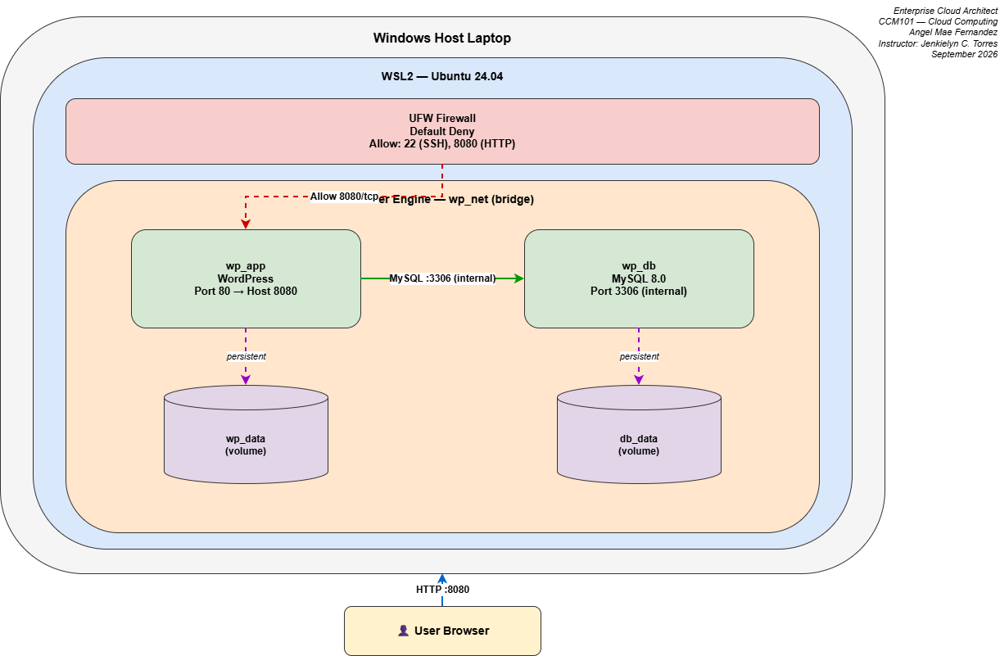

# Enterprise Cloud Architect – Operational Manual

---

## Cover Page

| | |
|---|---|
| **Course** | CCM101 – Cloud Computing |
| **Project** | Secure Multi-Tier Web Application |
| **Application Stack** | WordPress + MySQL 8.0 |
| **Document Title** | Enterprise Cloud Architect – Operational Manual |
| **Prepared by** | Angel Crisedio Fernandez | | Marlon DelMonte | | John Henry Roldan | | Ralph Lourene Micu |
| **Section** | BSIT 4I |
| **Instructor** | Jenkielyn C. Torres |
| **Date** | October 2026 |

---

## Table of Contents

1. [Executive Summary](#1-executive-summary)
2. [Architecture Overview](#2-architecture-overview)
3. [Prerequisites](#3-prerequisites)
4. [Deployment Procedure](#4-deployment-procedure)
5. [Security Configuration](#5-security-configuration)
6. [Automation & Disaster Recovery](#6-automation--disaster-recovery)
7. [Verification & Testing](#7-verification--testing)
8. [Maintenance & Operations](#8-maintenance--operations)
9. [Troubleshooting Guide](#9-troubleshooting-guide)
10. [Appendix – Full Code Listings](#10-appendix--full-code-listings)

---

## 1. Executive Summary

This document serves as the operational handover manual for a secure,
automated, multi-tier enterprise web application deployed on a private
cloud environment.

The infrastructure consists of:

- A **headless Ubuntu Server 24.04 LTS** virtual machine running on Oracle VirtualBox
- A **Docker + Docker Compose** container runtime
- A **WordPress** front-end web application container
- A **MySQL 8.0** database container with persistent storage volumes
- A **UFW firewall** enforcing a Default Deny inbound policy
- A **Bash + Cron automated backup system** for disaster recovery

The system is designed to be rebuilt from scratch on any Ubuntu Server
host using only this document, the `docker-compose.yml`, and the
`automation-script.sh`.

---

## 2. Architecture Overview



### Layer-by-Layer Description

**Layer 1 – Host Machine**
The physical laptop running Windows. It hosts the hypervisor and acts
as the operator workstation.

**Layer 2 – Hypervisor (Oracle VirtualBox, Type 2)**
Provides VM isolation and NAT-based networking. Port forwarding is
configured to expose the VM's services to the host:

| Host Port | Guest Port | Purpose |
|-----------|------------|---------|
| 2222 | 22 | SSH remote administration |
| 8080 | 80 | WordPress HTTP access |

**Layer 3 – Guest VM (Ubuntu Server 24.04 LTS)**
A headless Linux server with the internal NAT IP `10.0.2.15`.
It hosts the UFW firewall and Docker engine.

**Layer 4 – Firewall (UFW)**
Enforces a Default Deny policy on inbound traffic, with explicit
allow rules for SSH (22) and HTTP (8080).

**Layer 5 – Container Runtime (Docker Engine)**
Runs the application stack as two isolated containers on a private
bridge network (`wp_net`).

**Layer 6 – Application Containers**

- `wordpress_app` – Apache + PHP 8.3 + WordPress (published on port 8080)
- `wordpress_db` – MySQL 8.0 (internal only, port 3306)

**Layer 7 – Persistent Storage (Docker Named Volumes)**

- `enterprise-app_db_data` – mounted at `/var/lib/mysql`
- `enterprise-app_wp_data` – mounted at `/var/www/html`

These volumes survive container removal and VM reboots.

### Data Flow

1. Operator opens `http://localhost:8080` in the host browser.
2. VirtualBox forwards host port 8080 to guest port 8080.
3. UFW allows the incoming connection to port 8080.
4. Docker routes the request to `wordpress_app` port 80.
5. WordPress queries `wordpress_db` on port 3306 via the internal bridge.
6. MySQL reads/writes to the persistent volume `db_data`.

---

## 3. Prerequisites

### Hardware

- Laptop or desktop with 8 GB RAM minimum (4 GB allocated to VM)
- 30 GB free disk space
- Stable internet connection

### Software

- Oracle VirtualBox (latest)
- Ubuntu Server 24.04 LTS ISO
- A modern web browser
- (Windows only) PowerShell for SSH

### Knowledge

- Basic Linux command line
- Basic Docker concepts
- Basic networking (IP, ports, NAT)

---

## 4. Deployment Procedure

### Step 1 — Provision the VM

1. Open VirtualBox → **New**
2. Name: `CCM101-Enterprise-Architect`
3. Type: Linux / Version: Ubuntu (64-bit)
4. RAM: 2048 MB minimum (4096 recommended)
5. Disk: 20 GB dynamically allocated VDI
6. Mount the Ubuntu Server ISO and boot the VM
7. In the installer:
   - Set hostname: `CCM101-Enterprise-Architect`
   - Create user `angel` with a strong password
   - **Enable OpenSSH Server** during install
   - Skip featured snaps

### Step 2 — Configure Networking

1. Shut down the VM
2. Settings → Network → Adapter 1
3. Attached to: **NAT**
4. Advanced → Port Forwarding → Add:
   - SSH: `TCP | Host 2222 | Guest 22`
   - HTTP: `TCP | Host 8080 | Guest 8080`
5. Start the VM, log in, and confirm IP:

   ```
   hostname -I
   ```

   Expected: `10.0.2.15`

### Step 3 — Install Docker & Docker Compose

```bash
sudo apt update && sudo apt upgrade -y
sudo apt install -y docker.io docker-compose-v2
sudo usermod -aG docker $USER
newgrp docker
docker --version
docker compose version
```

### Step 4 — Create the Project Directory

```bash
mkdir -p ~/enterprise-app && cd ~/enterprise-app
```

### Step 5 — Create `docker-compose.yml`

Create the file with the contents in [Appendix A](#appendix-a--docker-composeyml).

### Step 6 — Create `init.sql`

MySQL 8.0 uses `caching_sha2_password` by default, which WordPress's
PHP mysqlnd client cannot always negotiate. This init script forces
`mysql_native_password` for the WordPress user.

```bash
cat > init.sql << 'EOF'
ALTER USER 'wpuser'@'%' IDENTIFIED WITH mysql_native_password BY 'SuperWpPass123!';
FLUSH PRIVILEGES;
EOF
```

### Step 7 — Deploy the Stack

```bash
docker compose up -d
docker compose ps
```

Wait 60–90 seconds for MySQL to initialize. Then open your host
browser to `http://localhost:8080` and complete the WordPress setup
wizard.

---

## 5. Security Configuration

### UFW (Uncomplicated Firewall)

```bash
sudo ufw default deny incoming
sudo ufw default allow outgoing
sudo ufw allow 22/tcp comment 'SSH'
sudo ufw allow 8080/tcp comment 'WordPress App'
sudo ufw --force enable
sudo ufw status verbose
```

### Expected Output

```
Status: active
Logging: on (low)
Default: deny (incoming), allow (outgoing), deny (routed)

To                         Action      From
--                         ------      ----
22/tcp                     ALLOW IN    Anywhere                   # SSH
8080/tcp                   ALLOW IN    Anywhere                   # WordPress App
```

### Security Principles Applied

- **Default Deny** — no unsolicited inbound connection reaches the VM
- **Least Privilege** — only ports 22 and 8080 are open
- **Database Isolation** — MySQL port 3306 is NOT exposed to the host;
  it is only reachable inside the `wp_net` Docker bridge network
- **Volume Isolation** — persistent data lives in Docker volumes, not
  bind mounts, limiting filesystem exposure
- **Separate Credentials** — root DB password and application DB
  password are distinct

---

## 6. Automation & Disaster Recovery

### Backup Script

Located at `/home/angel/enterprise-app/backup.sh` — see
[Appendix B](#appendix-b--automation-scriptsh).

It:

1. Dumps all MySQL databases from the `wordpress_db` container
2. Compresses the dump with gzip
3. Stores it in `~/enterprise-app/backups/`
4. Logs the result to `backup.log`
5. Retains only the most recent 7 daily backups

### Cron Schedule

```cron
0 2 * * * /home/angel/enterprise-app/backup.sh >> /home/angel/enterprise-app/cron.log 2>&1
```

The backup runs **every day at 02:00**.

### Restore Procedure

To restore a backup:

```bash
cd ~/enterprise-app/backups
ls -lt   # find the newest .sql.gz

gunzip -c wordpress_db_YYYYMMDD_HHMMSS.sql.gz | \
  docker exec -i wordpress_db mysql -uroot -pSuperRootPass123!
```

---

## 7. Verification & Testing

### Container Status

```bash
docker compose ps
```

Both `wordpress_app` and `wordpress_db` should show `Up`.

### Volume Persistence

```bash
docker compose down
docker compose up -d
```

After restart, WordPress site and admin credentials remain intact —
proving the named volumes work.

### Volume Listing

```bash
docker volume ls
```

Should show `enterprise-app_db_data` and `enterprise-app_wp_data`.

### Firewall Status

```bash
sudo ufw status verbose
```

### Backup Verification

```bash
ls -lh ~/enterprise-app/backups/
cat ~/enterprise-app/backup.log
```

### Remote Access

From the Windows host:

```bash
ssh -p 2222 angel@localhost
```

### Browser Access

From the Windows host:

```
http://localhost:8080        → live WordPress site
http://localhost:8080/wp-admin/  → admin dashboard
```

---

## 8. Maintenance & Operations

### Daily

- Cron automatically runs the DB backup at 02:00

### Weekly

- Verify backup files exist: `ls -lh ~/enterprise-app/backups/`
- Review backup log: `tail -20 ~/enterprise-app/backup.log`

### Monthly

- Update Ubuntu packages: `sudo apt update && sudo apt upgrade -y`
- Update Docker images:

  ```bash
  cd ~/enterprise-app
  docker compose pull
  docker compose up -d
  ```

### On Failure

- Check logs: `docker compose logs --tail 50`
- Restart: `docker compose restart`
- Full rebuild from backup (see Section 6)

---

## 9. Troubleshooting Guide

| Symptom | Likely Cause | Fix |
|---------|-------------|-----|
| `hostname -I` blank | Bridged adapter can't bridge to Wi-Fi | Switch VirtualBox to NAT |
| `Connection refused` on SSH | Port forwarding guest port wrong | Guest port must be 22, host port 2222 |
| "Error establishing a database connection" | MySQL 8 `caching_sha2_password` | Apply `init.sql` with `mysql_native_password` |
| Access denied for `wpuser@localhost` | Testing from inside DB container | Use `-h 127.0.0.1` or `-uroot` |
| Docker Compose `version` warning | Obsolete compose syntax | Remove the `version: '3.8'` line |
| Port 8080 not reachable | UFW blocking | `sudo ufw allow 8080/tcp` |
| Backup file empty (0 bytes) | `docker exec` failed | Verify container name with `docker ps` |

---

## 10. Appendix – Full Code Listings

### Appendix A – `docker-compose.yml`

```yaml
services:
  db:
    image: mysql:8.0
    container_name: wordpress_db
    restart: unless-stopped
    environment:
      MYSQL_ROOT_PASSWORD: SuperRootPass123!
      MYSQL_DATABASE: wordpress
      MYSQL_USER: wpuser
      MYSQL_PASSWORD: SuperWpPass123!
    volumes:
      - db_data:/var/lib/mysql
      - ./init.sql:/docker-entrypoint-initdb.d/init.sql:ro
    networks:
      - wp_net

  wordpress:
    image: wordpress:latest
    container_name: wordpress_app
    restart: unless-stopped
    ports:
      - "8080:80"
    environment:
      WORDPRESS_DB_HOST: db:3306
      WORDPRESS_DB_USER: wpuser
      WORDPRESS_DB_PASSWORD: SuperWpPass123!
      WORDPRESS_DB_NAME: wordpress
    volumes:
      - wp_data:/var/www/html
    depends_on:
      - db
    networks:
      - wp_net

volumes:
  db_data:
  wp_data:

networks:
  wp_net:
    driver: bridge
```

### Appendix B – `automation-script.sh`

```bash
#!/bin/bash
BACKUP_DIR="/home/angel/enterprise-app/backups"
TIMESTAMP=$(date +"%Y%m%d_%H%M%S")
FILENAME="wordpress_db_${TIMESTAMP}.sql.gz"
LOG_FILE="/home/angel/enterprise-app/backup.log"

mkdir -p "$BACKUP_DIR"

docker exec wordpress_db sh -c \
  'exec mysqldump --all-databases -uroot -pSuperRootPass123!' \
  | gzip > "$BACKUP_DIR/$FILENAME"

if [ -f "$BACKUP_DIR/$FILENAME" ]; then
  echo "[$(date)] SUCCESS: $FILENAME ($(du -h "$BACKUP_DIR/$FILENAME" | cut -f1))" >> "$LOG_FILE"
else
  echo "[$(date)] FAILED: Backup was not created" >> "$LOG_FILE"
fi

find "$BACKUP_DIR" -type f -name "wordpress_db_*.sql.gz" -mtime +7 -delete
exit 0
```

### Appendix C – `init.sql`

```sql
ALTER USER 'wpuser'@'%' IDENTIFIED WITH mysql_native_password BY 'SuperWpPass123!';
FLUSH PRIVILEGES;
```

---

*End of Operational Manual*
